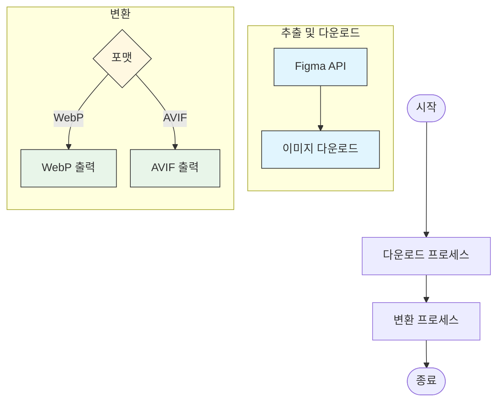

# fig2img

[English](./README.md)

### Features

- Figma 이미지 노드 다운로드
- PNG를 WebP로 변환
- PNG를 AVIF로 변환

### Supported OS

- MacOS (Apple Silicon/Intel)

### Getting Started

#### Installation

Homebrew를 사용하여 설치할 수 있어요:

```bash
brew tap geonhyeoklee/fig2img
brew install fig2img
```

설치 확인:
```bash
fig2img --version
```

또는 다음 방법으로도 설치할 수 있어요:
1. GitHub Releases 페이지에서 최신 버전을 다운로드
2. 다음 중 하나의 방법으로 사용할 수 있어요:
   - 다운로드 받은 위치에서 아래 사용법에 따라 실행
   - `/usr/local/bin`으로 이동하여 시스템 어디서나 실행 가능하게 설정

> 참고: macOS에서는 실행 파일을 실행하기 위해 보안 권한을 부여해야 할 수 있어요.

#### Environment Setup

환경 변수를 설정해야 해요:

```bash
# fig2img
export FIGMA_ACCESS_TOKEN="YOUR_ACCESS_TOKEN"
export FIGMA_FILE_KEY="YOUR_FILE_KEY"
# fig2img end
```

### Usage

#### Download Images

```bash
fig2img download --output "YOUR_DIRECTORY"
```

#### Convert Images

```bash
fig2img convert --input "YOUR_DIRECTORY" --output "YOUR_DIRECTORY"
fig2img convert --input "YOUR_DIRECTORY" --output "YOUR_DIRECTORY" --format webp
fig2img convert --input "YOUR_DIRECTORY" --output "YOUR_DIRECTORY" --format avif
```

### How it works


