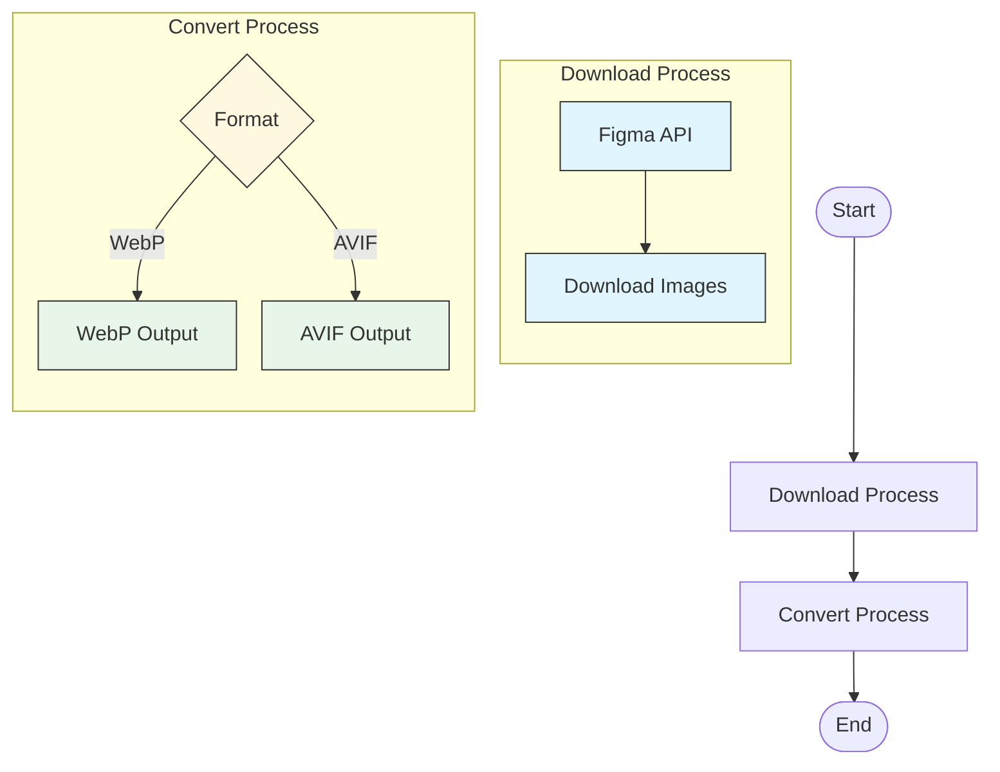

# fig2img

[한국어](./README.ko.md)

### Features

- Download Figma image nodes
- Convert PNG to WebP
- Convert PNG to AVIF

### Supported OS

- MacOS (Apple Silicon/Intel)

### Getting Started

#### Installation

You can install fig2img using Homebrew:

```bash
brew tap geonhyeoklee/fig2img
brew install fig2img
```

Verify the installation:
```bash
fig2img --version
```

Alternatively, you can:
1. Download the latest release from GitHub Releases page
2. You can either:
   - Run the executable from the downloaded location using the usage instructions below
   - Move it to `/usr/local/bin` to run it from anywhere in your system

> Note: On macOS, you might need to grant security permissions to run the executable.

#### Environment Setup

Set up your environment variables:

```bash
# fig2img
export FIGMA_ACCESS_TOKEN="YOUR_ACCESS_TOKEN"
export FIGMA_FILE_KEY="YOUR_FILE_KEY"
# fig2img end
```

### Usage

#### Download Images

```bash
fig2img download --output "YOUR_DIRECTORY"
```

#### Convert Images

```bash
fig2img convert --input "YOUR_DIRECTORY" --output "YOUR_DIRECTORY"
fig2img convert --input "YOUR_DIRECTORY" --output "YOUR_DIRECTORY" --format webp
fig2img convert --input "YOUR_DIRECTORY" --output "YOUR_DIRECTORY" --format avif
```

### How it works


